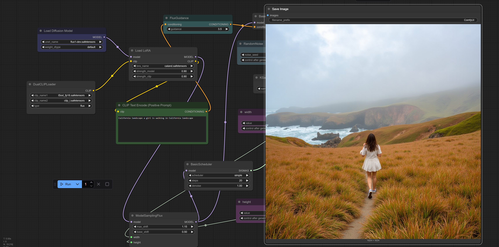
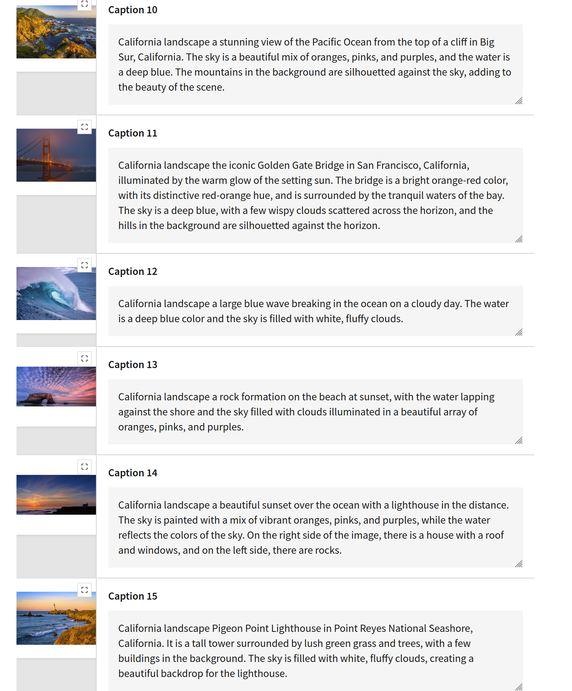
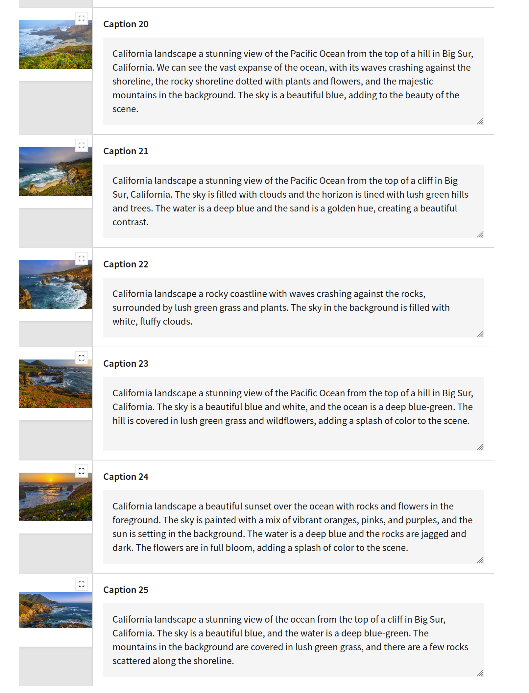
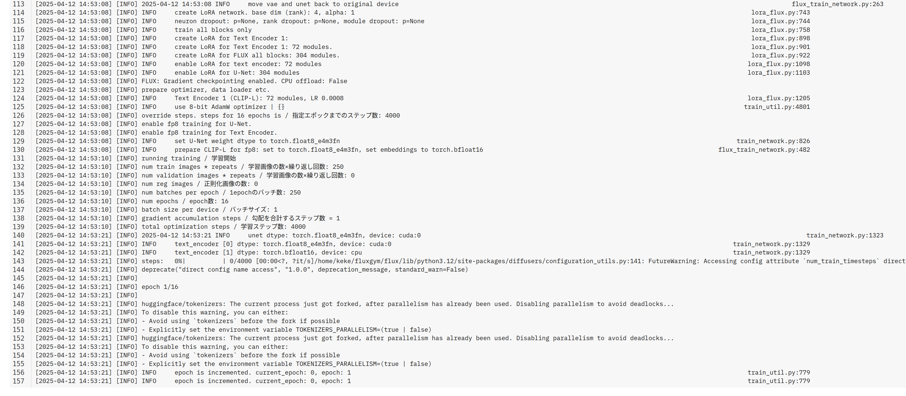

In this LoRA finetuning example, use some California landscape pictures, and put description for each pictures or generate description automatically. then run fineturing script, a rtx 4090 was used and runing about 3~4 hours and got the caland.safetensors LoRA model, and then user can use this LoRA modle combine with flux1-dev model, the flux1-dev is the original downloaded without any change. when use this modle, must input "California landscape" as prompt which will triger the caland LoRA model, see the example in below pictures, and finally we see the generated picture use California beach as the background, which is come from training picutres.

Fine tunning pictures

Run fine tuning

