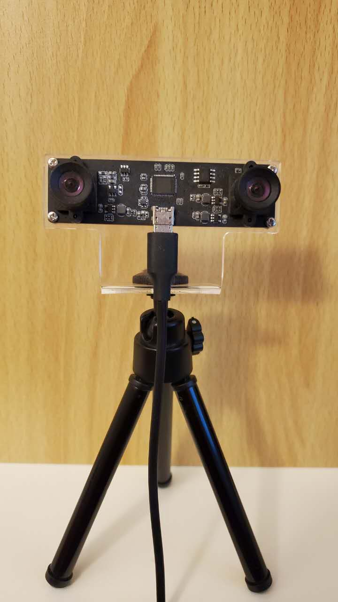
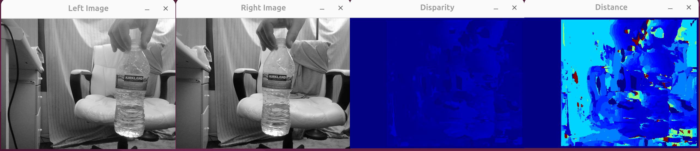

Show some opencv examples, all these examples are test based one below environment.

OS: Ubuntu 24.04 with g++ 13.3
RTX 4090 with CUDA driver 570 and toolkit 12.8, CudaDNN installed.
opencv 4.x built with cuda and codacodec ON
All dependencies libs installed

Stereo camera device is in the below picture:

1 stereo_distance:  in this example, a stereo camera is used to get the distance, and the result show the left picture and right picture and also the disparity picture and distance picture. In the distance picture some color are used to show far and near, near is read and far is blue, from near to far is red, yellow, green and blue.

2 object_track: in this example, a stereo camera is used, a bottle of water is inside both camera's sight, and then choose the bottle of water as the target to track(you need select the rectangle area of the bottle manually), then use the openCV track algorithm CSRT to track it.

3 object_detect: in this example, a stereo camera is used, however only get image from left len, need used libtorch and opencv as dependencies. Before start, get a yolov8s.torchscript model, it can be exported from yolov8s.pt. And you may change model to see the difference without change code logic. After detect use opencv to put result on image and showing in realtime. This code use CPU so as to easy compile and run in you local, you need plug in a usb camera, build or download dependencies, and then can compile and run.

 