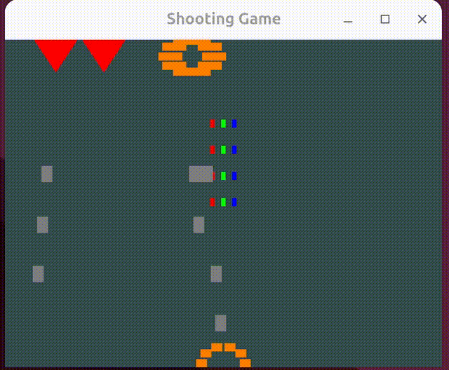

In these openGL examples,  use some simple programs to show how to test and draw, interaction using openGL.

1. For test the openGL library is correctly installed. if you can run the program and see the below picture, it looks openGL is correctly installed.
2. Let's draw 3 bouncing balls inside an rectangle, let's them bounce to the wall or bounce to each other.

3. A simple game, in this game you will use a weapon breavely fight with 5 enemy bombers.
  

